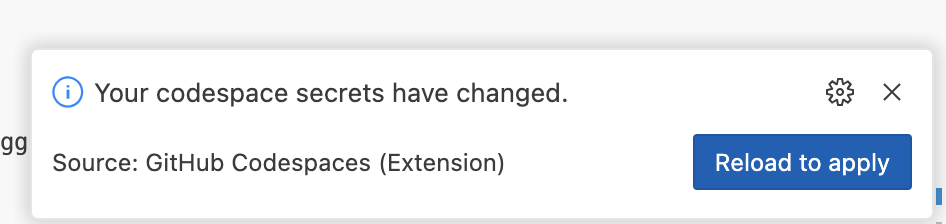

# Using Hugging Chat (UI) with Contoso Chat (AI)

## 1 | Add Dev Container Support
- Added .devcontainer directory
- Opened in GitHub Codespaces

## 2 | Configure Local Dev
 - Follow the [Setup](../README.md#setup) instructions instructions in this repo README
 - **Typically** we would need to create `.env.local` file
    - Add `MONGODB_URL=` set to relevant MongoDB database endpoint
    - Add `HF_TOKEN` = set to Hugging Face token for your profile
 - But because we are using GitHub Codespaces
    - Create these environment variables as [GitHub Codespaces Secrets](https://github.com/settings/codespaces)
    - Update each variable to associate relevant repos for use
      
    - Now when Codespaces is launched, the vars show up automatically
    - I don't need to create or maintain the `.env.local` file

## 3 | Use Azure Cosmos DB

1. Hugging Chat can be used with any MongoDB-compliant endpoint
1. Let's setup one using Azure Cosmos DB (within Contoso Chat RG)
1. Create new Azure Cosmos DB for MongoDB resource in `contchat-rg`
    
1. Pick the default plan for CosmosDB for MongoDB
    
1. Review and confirm creation with defaults
    
1. Watch the deployment status indicator for progress
    
1. When deployment complete, click to **Go to resource**
    
1. Look for the `Connection strings` item in sidebar
    
1. Copy `PRIMARY_CONNECTION_STRING` value to MONGODB_URL secret in Codespaces
    
1. When you save that, active codespaces will detect change & rebuild
    
1. Verify that the env variable has been updated by using this command in the VS Code terminal:  ```env | grep MONGODB_URL```
1. Note: You must copy the **Connection String** URL to the `MONGODB_URL` secret in GitHub else you may see an error like this when you launch the chat app.
  ```
  MongoParseError: Invalid scheme, expected connection string to start with "mongodb://" or "mongodb+srv://"
  ```

## 4 | Run Hugging Chat Locally To Test

1. Follow the [Launch](../README.md#launch) instructions in this repo README
  ```bash
  npm install
  npm run dev
  ```
1. On startup you should see a notification like this:
    
1. Open the browser to the URL to see this:
    
1. Click "start chatting" to get Hugging Chat UI
    
1. Ask a question to see default chat model in action
    
1. Now visit the CosmosDB database to verify data is stored
    

## 5 | Explore Using A Different OpenAI EP